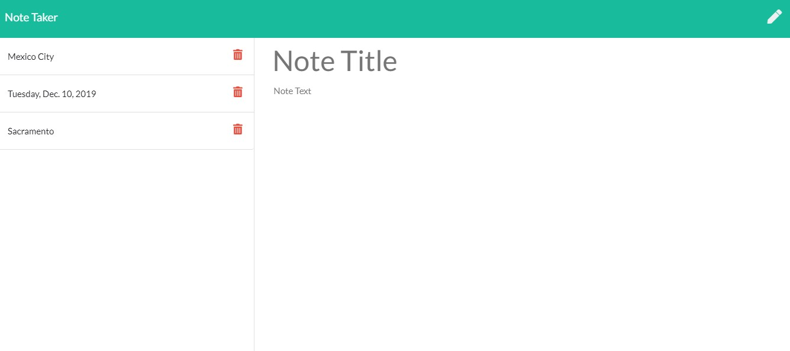

# Note Taker Web Application

**Motivation**
This is a web based note taker application that allow a user to enter, save and delete notes.

**Build status**

The build status is complete.

**Code style**

The application is written in JavaScript and use Express.js to run the server side logic for the application. Front end JavaScript uses jquery for DOM navigation.

**Screenshots**



**Code Example**

```javascript
//Delete api target an object by the object's id in the db json file after a user deletes a note.
app.delete("/api/notes/:id", function deleteNote(req, res) {
  var noteId = req.body.id;

  fs.readFile("./db/db.json", "utf8", function getNoteId(err, d) {
    console.log("this is the array", d);
    noteArray = JSON.parse(d);

    for (var i = 0; i < noteArray.length; i++) {
      console.log(noteArray[i]);
      if (noteArray[i].id === noteId) {
        noteArray.splice(i, 1);

        fs.writeFile("./db/db.json", JSON.stringify(noteArray), "utf8", err => {
          if (err) throw err;
        });
      }
    }
  });
});
```

**Installation**

No installation necessary. Project is hosted here: https://github.com/uchrissd/note-taker-app
